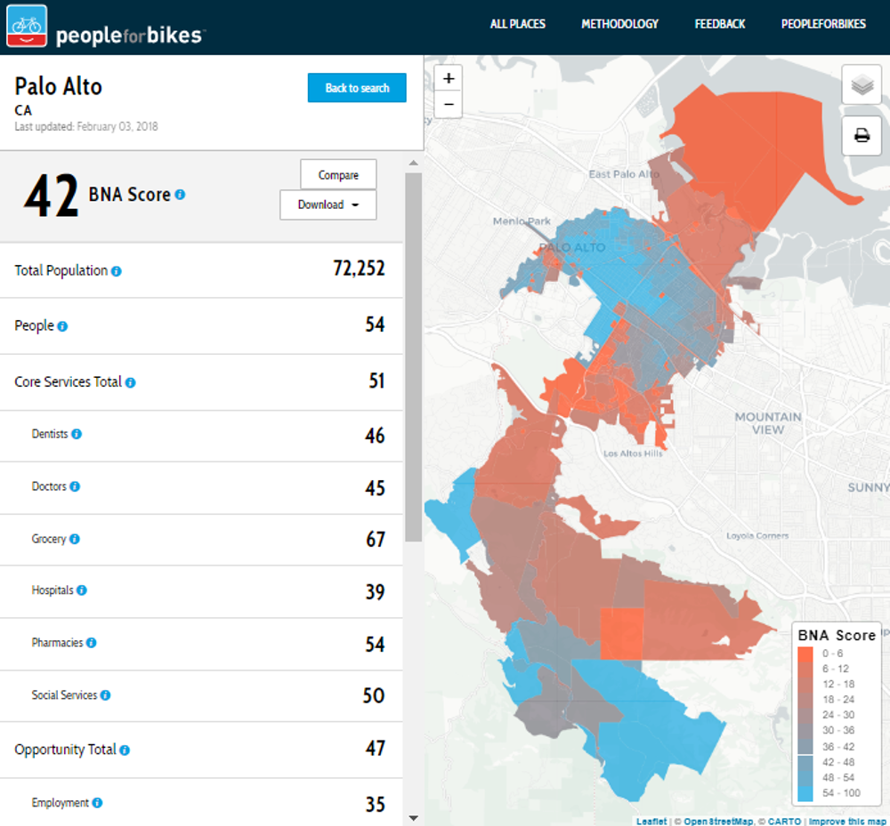
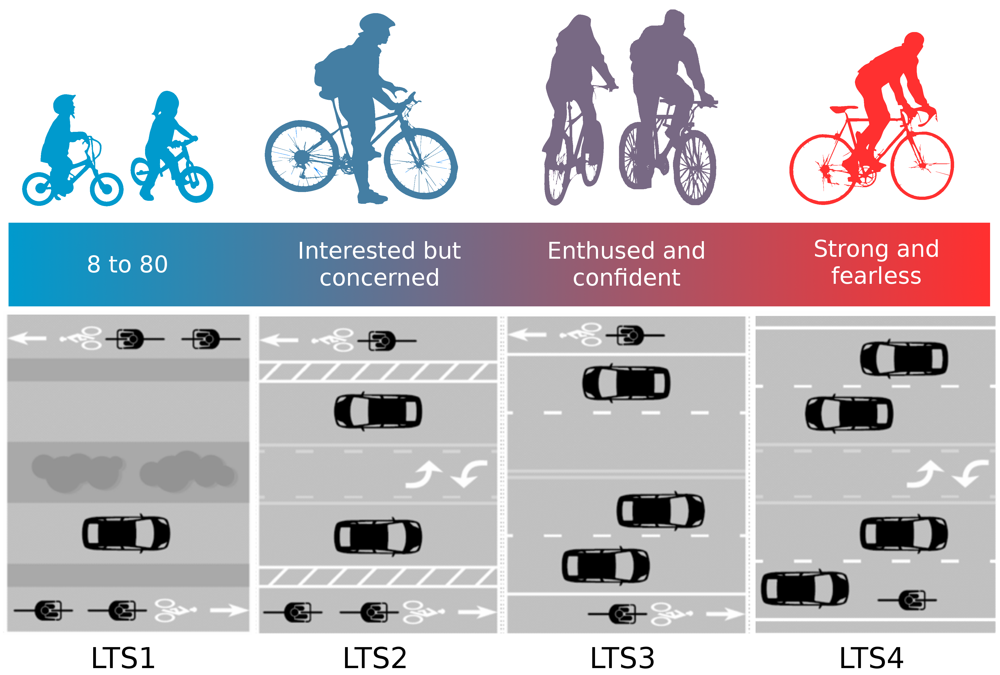
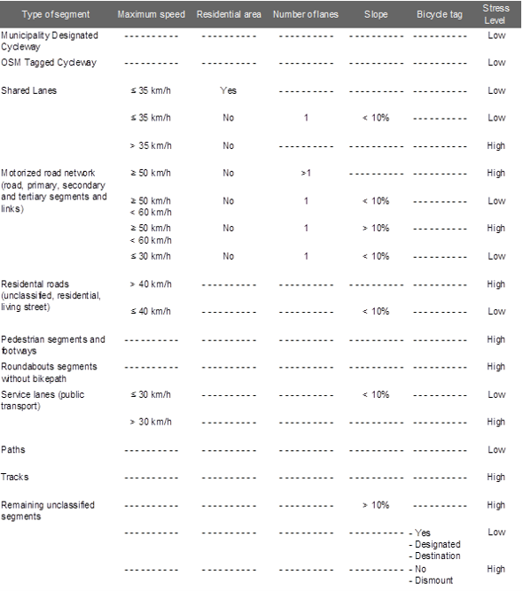
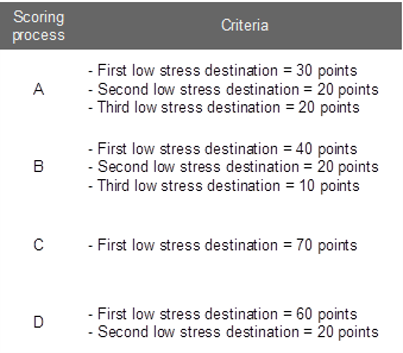
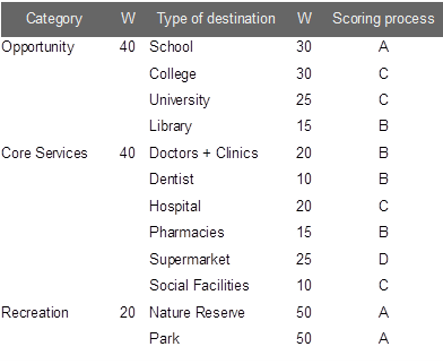
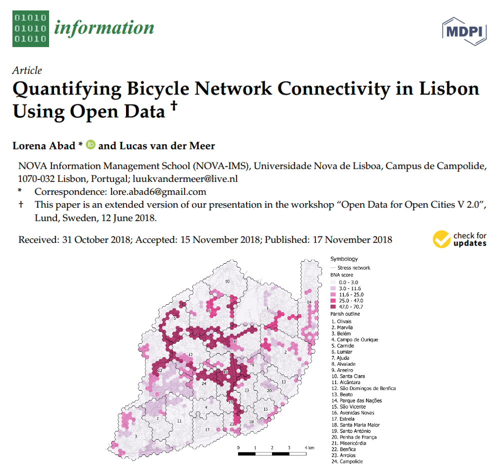
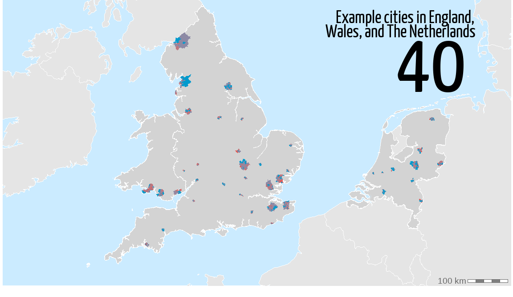
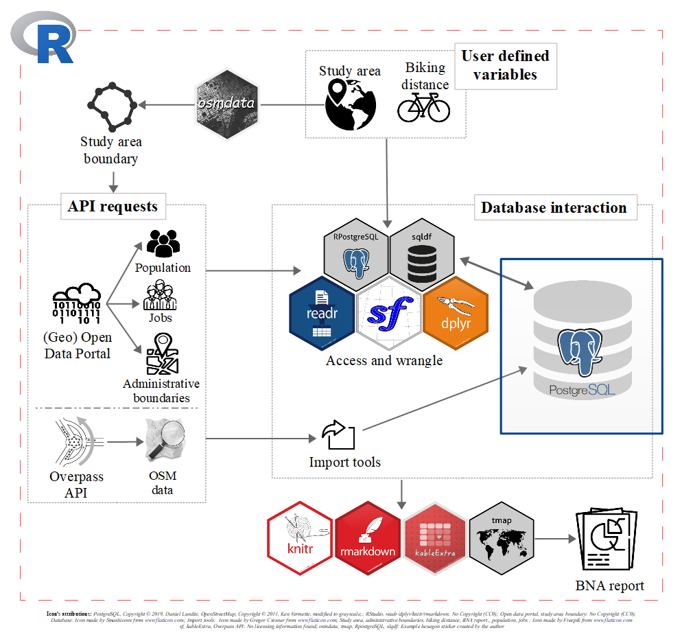

```{r setup, include=FALSE}
options(htmltools.dir.version = FALSE)
knitr::opts_chunk$set(message = F, warning = F, fig.width = 22, fig.height = 15, fig.align = 'center', cache = T)
```

```{r, include = F}
library(sf)
library(ggplot2)
library(dplyr)
library(patchwork)
```

```{r, include = F}
grid = st_read('data/bna_grid_lisbon.geojson')

grid_freg = grid %>% 
  group_by(freguesia) %>% 
  summarise(
    bna = mean(bna),
    geometry = st_union(geometry)
  ) 

net = st_read('data/stress_network_lisbon.geojson')

cycleways = st_read('data/cycleways_2018_lisbon.geojson')

services = st_read('data/services_lisbon.geojson')
```

```{r, include = F}
gg1 = ggplot() +
  geom_sf(data = net, color = 'grey80') +
  geom_sf(data = cycleways, color = 'limegreen', size = 1) +
  theme_void() +
  theme(text = element_text(size = 30), legend.key.height = unit(10, 'mm'))

gg2 = ggplot() +
  geom_sf(data = net, aes(color = stress)) +
  scale_color_manual(
    'Stress Network', 
    values = c('firebrick1', 'deepskyblue3'),
    labels = c('High stress', 'Low stress')
  ) +
  theme_void() +
  theme(text = element_text(size = 30), legend.key.height = unit(10, 'mm'))

gg3 = ggplot() +
  geom_sf(data = net, color = 'grey80') +
  geom_sf(data = services, aes(color = service_type), size = 3) +
  scale_color_discrete('Destination type') +
  theme_void() +
  theme(text = element_text(size = 30), legend.key.height = unit(10, 'mm'))

gg4 = ggplot() +
  geom_sf(data = net, color = 'grey30') +
  geom_sf(data = grid, aes(fill = bna), color = 'grey90', lwd = 0.01, alpha = 0.8) +
  scale_fill_distiller('BNA', limits = c(0,71), palette = 'RdPu', direction = 1) +
  theme_void() +
  theme(text = element_text(size = 30), legend.key.height = unit(10, 'mm'))

gg5 = ggplot() +
  geom_sf(data = net, color = 'grey30') +
  geom_sf(data = grid_freg, col = 'grey70', aes(fill = bna), size = 1, alpha = 0.8) +
  geom_sf_text(data = grid_freg, aes(label = round(bna,0)), size = 10) +
  scale_fill_distiller('BNA', limits = c(0,71), palette = 'RdPu', direction = 1) +
  theme_void() +
  theme(text = element_text(size = 30), legend.key.height = unit(10, 'mm'))

dim = get_dim(gg2)
```

## What is the Bicycle Network Analysis?

.pull-left[



Developed by [PeopleForBikes](https://peopleforbikes.org/) for the U.S.

]

.pull-right[
### How well the **<span style="color:#009ACD;">bike network</span>** in a community connects people with the **<span style="color:#009ACD;">places they want to go</span>**.
]

---

## What is the Bicycle Network Analysis?

Levels of Traffic Stress

.center[]

---

## What is the Bicycle Network Analysis?

Classification criteria based on OpenStreetMap

.center[]
---

## What is the Bicycle Network Analysis?

Destinations scoring criteria

.pull-left[]

.pull-right[]

---

## Lisbon case study 

.center[[](https://www.mdpi.com/2078-2489/9/11/287)]

---

## Lisbon case study - Available cycleways in 2018

```{r, echo = F}
set_dim(gg1, dim)
```

---

## Lisbon case study - Level of cycling stress

```{r, echo = F}
set_dim(gg2, dim)
```

---

## Lisbon case study - Destinations

```{r, echo = F}
set_dim(gg3, dim)
```

---

## Lisbon case study - BNA per grid cell

```{r, echo = F}
set_dim(gg4, dim)
```

---

## Lisbon case study - BNA per municipality

```{r, echo = F}
set_dim(gg5, dim)
```

--
Overall result: 8.6 out of a 100!

---
class: center, middle

## BNA validation

--

### Is the BNA score truely representing bicycle network connectivity?

--



---

## BNA validation - conclusions

- More people bike if there is a low stress network connecting their origin to their destination...

--

... but only by a marginal difference!

--

- People don't seem to be biking to the destinations the BNA score considers...

--

... hence, destinations should be reconsidered and adapted according to city context.

--

- Cities with a high BNA score seem to have a higher cycling share!...

--

... but my analysis only included home-to-work trips.

---

## Technology behind - Lisbon case study


---

## Technology behind - BNA validation case studies

.center[]

[Link to repo!](https://github.com/loreabad6/masters-thesis-geotech)

---

## Technology behind - Potential improvements...

.pull-left[.right[Make it completely **R** based]]

--

.pull-right[... using [sfnetworks](https://github.com/luukvdmeer/sfnetworks)!]


--
<br><br><br>

.pull-left[.center[

]]

--

.pull-right[.center[

]]

--

For more info check the [slides for our webinar](https://sfnetworks.github.io/sfnetworks-webinar/) or the recording [here](https://www.youtube.com/watch?reload=9&v=ZXTNXsvKYwo&ab_channel=RobinLovelace)!

---
class: center, middle, inverse

### Thank you!

Contact:

`r anicon::faa("twitter", color = 'white', animate="wrench", anitype="parent-hover",rtext = "    [**@loreabad6**](https://twitter.com/loreabad6)") `

`r anicon::faa("github", color = 'white', animate="wrench", anitype="parent-hover",rtext = "    [**loreabad6**](https://github.com/loreabad6)") `

.left[.footnote[Slides powered by [**xaringan**](https://github.com/yihui/xaringan)]]